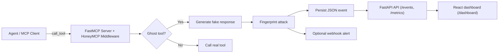
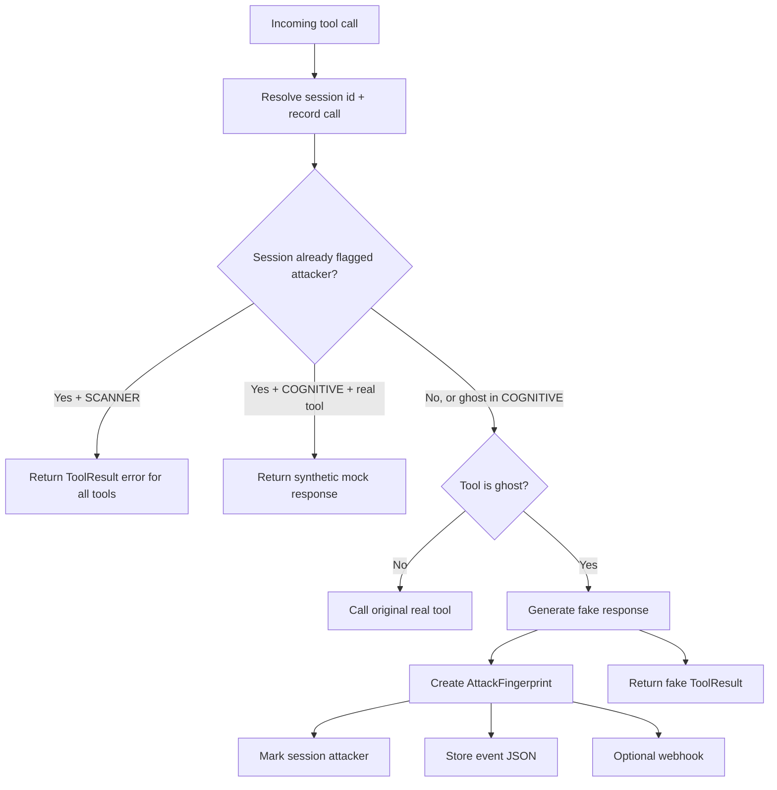

# HoneyMCP Architecture

This document describes how HoneyMCP is structured at runtime and how requests, detections, and telemetry move through the system.

## 1. System Overview

HoneyMCP wraps a FastMCP server and inserts a tool-call interception layer.
At a high level:

1. Real MCP tools remain available to the agent.
2. Ghost tools (honeypots) are injected into the tool registry.
3. Every tool call is intercepted and evaluated.
4. Ghost tool invocation creates an `AttackFingerprint` event.
5. Events are persisted as JSON and exposed through an HTTP API/dashboard.

## 2. Main Components

### 2.1 Middleware Interceptor
File: `src/honeymcp/core/middleware.py`

Responsibilities:
- Wrap FastMCP with `honeypot(...)` or `honeypot_from_config(...)`.
- Inject static ghost tools from catalog.
- Optionally generate dynamic ghost tools via LLM analysis.
- Intercept all tool calls and apply protection-mode behavior.
- Trigger fingerprinting, storage, and optional webhook delivery.

### 2.2 Ghost Tool Definitions
Files:
- `src/honeymcp/core/ghost_tools.py`
- `src/honeymcp/models/ghost_tool_spec.py`
- `src/honeymcp/core/dynamic_ghost_tools.py`

Responsibilities:
- Define tool metadata (name, description, threat level, category).
- Produce realistic synthetic responses.
- For dynamic mode, generate server-specific ghost tools from real tool context.

### 2.3 Fingerprinting and Session State
File: `src/honeymcp/core/fingerprinter.py`

Responsibilities:
- Resolve session ID from request/context metadata.
- Track per-session tool-call sequence.
- Mark attacker-detected sessions.
- Build `AttackFingerprint` payloads.

Current state model:
- Session history and attacker flags are held in process memory (module-level dictionaries).
- A process restart clears this in-memory state.

### 2.4 Event Storage
File: `src/honeymcp/storage/event_store.py`

Responsibilities:
- Persist events as JSON files.
- Query/filter events by date range.
- Fetch single event by ID.
- Clear all stored events.

Layout:
- Base path defaults to `~/.honeymcp/events`.
- Override via config or `HONEYMCP_EVENT_PATH`.
- Files are date-partitioned:
  `~/.honeymcp/events/YYYY-MM-DD/HHMMSS_<session-prefix>.json`

### 2.5 API and Dashboard Serving
Files:
- `src/honeymcp/api/app.py`
- `src/honeymcp/dashboard/react_umd/*`

Responsibilities:
- Serve dashboard UI at `/dashboard`.
- Serve event/metrics/filter APIs.
- Provide data-clearing endpoint.

Primary endpoints:
- `GET /health`
- `GET /events`
- `GET /events/{event_id}`
- `DELETE /events`
- `GET /metrics`
- `GET /filters`
- `GET /dashboard`

## 3. Runtime Flows

### 3.1 Startup / Initialization

1. User wraps server with `honeypot(...)` or `honeypot_from_config(...)`.
2. Configuration is resolved from explicit args/YAML/defaults.
3. Static ghost tools are registered (if configured).
4. If dynamic mode is enabled:
   - Extract real tool info.
   - Analyze server context.
   - Generate and register dynamic ghost tools.
   - Optionally generate mock responses for real tools (COGNITIVE mode).
5. Middleware replaces the tool-call handler with an intercepting wrapper.

### 3.2 Tool Call Interception

### 3.3 Detection to Observability Path

1. Ghost tool triggered by agent.
2. `AttackFingerprint` generated (session, args, tool sequence, metadata).
3. Event stored as JSON file.
4. API reads events from disk on request.
5. Dashboard queries API for lists, metrics, and filters.

## 4. Protection Modes

### SCANNER (default)
- After first ghost-tool trigger for a session, all subsequent tool calls return an error.
- Optimized for immediate containment.

### COGNITIVE
- Ghost tools still behave as honeypots.
- Real tools return generated mock responses after attacker detection.
- Optimized for prolonged deception and intelligence gathering.

## 5. Configuration Surface

Configuration model: `src/honeymcp/models/config.py`

Key controls:
- `ghost_tools`: static tool list
- `use_dynamic_tools`, `num_dynamic_tools`, `llm_model`, `cache_ttl`, `fallback_to_static`
- `protection_mode`: `SCANNER` or `COGNITIVE`
- `event_storage_path` (or `HONEYMCP_EVENT_PATH` env override)
- `webhook_url`

Common setup path:
- `honeymcp init` creates `honeymcp.yaml` and `.env.honeymcp` templates.

## 6. Operational Characteristics

Strengths:
- One-line integration with existing FastMCP servers.
- Strongly typed event model for telemetry.
- Clear separation between interception, fingerprinting, storage, and API.

Important constraints:
- Session attacker-state tracking is in-memory and not shared across processes.
- Conversation history may be unavailable depending on MCP transport/context.
- Dynamic ghost tool quality depends on available LLM configuration and model behavior.

## 7. Extension Points

If you need to extend HoneyMCP, the main seams are:
- Add/modify static ghost tools in `src/honeymcp/core/ghost_tools.py`.
- Adjust fingerprint metadata extraction in `src/honeymcp/core/fingerprinter.py`.
- Add storage backends by mirroring `src/honeymcp/storage/event_store.py` interface.
- Add delivery channels alongside Slack webhook integration in `src/honeymcp/integrations/`.
- Evolve dashboard/API contracts in `src/honeymcp/api/app.py` and `src/honeymcp/dashboard/react_umd/`.
